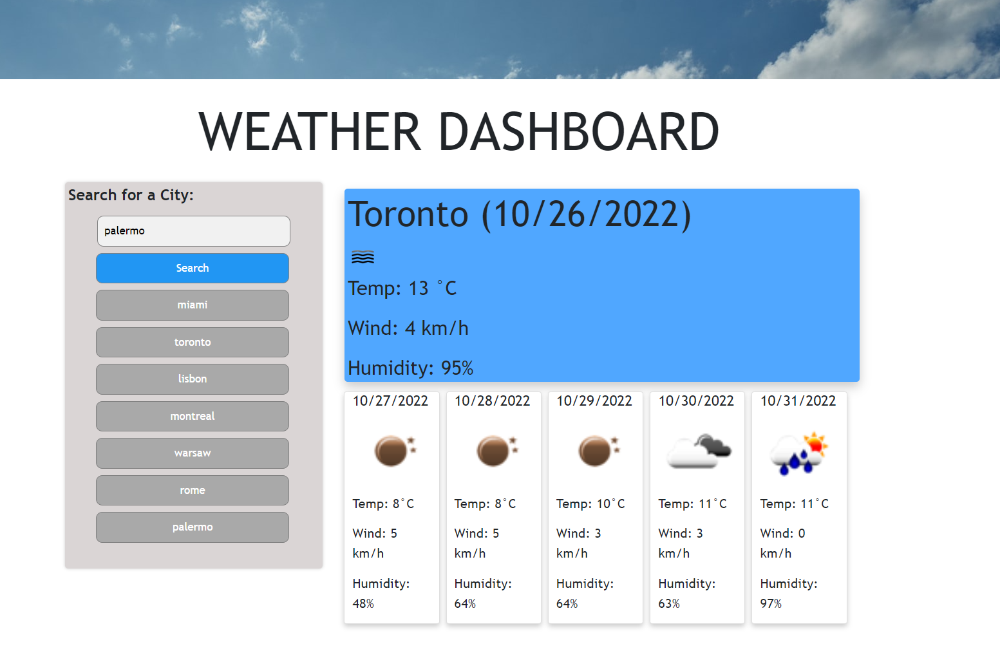

# 06 Server-Side APIs: Weather Dashboard

[Launch Weather Dashboard](https://samdemarco.github.io/weather-dashboard/)

Here is a snapshot of my finsihed dashboard:


## Challenges

Biggest challenge by far was keeping track of the already seached cities and ensuring that they were not being duplicated in the "history list". I decided to do continuous Fetch calls to OpenWeather to do comparisons in order to mitigate duplicate cities but I could of made the code easier by just declaring an array and push() calls with every new city search and then later use it for comparison!   
  
## Assignment Details 

Use the OpenWeather One Call API to retrieve weather data for cities. Read through the documentation for setup and usage instructions. You will use localStorage to store any persistent data. For more information on how to work with the OpenWeather API, refer to the Full-Stack Blog on how to use API keys.


## User Story

```
AS A traveler
I WANT to see the weather outlook for multiple cities
SO THAT I can plan a trip accordingly
```

## Acceptance Criteria

```
GIVEN a weather dashboard with form inputs
WHEN I search for a city
THEN I am presented with current and future conditions for that city and that city is added to the search history
WHEN I view current weather conditions for that city
THEN I am presented with the city name, the date, an icon representation of weather conditions, the temperature, the humidity, the wind speed, and the UV index
WHEN I view the UV index
THEN I am presented with a color that indicates whether the conditions are favorable, moderate, or severe
WHEN I view future weather conditions for that city
THEN I am presented with a 5-day forecast that displays the date, an icon representation of weather conditions, the temperature, the wind speed, and the humidity
WHEN I click on a city in the search history
THEN I am again presented with current and future conditions for that city
```

## My Development Enviromment:
  
  * Visual Studio Code
  * Gitbash Terminal
  * Github
  * Moment.js API for dates and times
  * JQuery APIs
  * Bootstrap for CSS styling
  * Google Fonts
  * OpenWeather API
